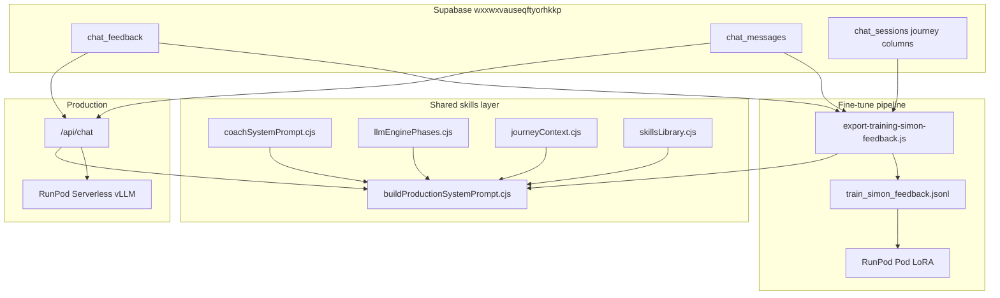

# Super prompt: training uses the same stack as production

**Goal:** LoRA fine-tune on Simon feedback + final assistant replies with the **same system prompt assembly** as live `/api/chat` — not a shortened training stub.

---

## Parity rule

Every JSONL training example must use `buildProductionSystemPrompt()` from `skills/buildProductionSystemPrompt.cjs`.

That function is the single source of truth for prompt assembly order:

| Layer | Source module | Also documented in |
|-------|---------------|-------------------|
| Coach identity + rules + crisis | `skills/coachSystemPrompt.cjs` | `docs/SUPER-PROMPT-CRISIS-TRIAGE.md`, `docs/SUPER-PROMPT-OPENING-PHASE.md`, `docs/SUPER-PROMPT-MIRRORING-AND-TONALITY.md` |
| Platform phases (1–3) | `skills/llmEnginePhases.cjs` | `docs/SUPER-PROMPT-LLM-ENGINE-PHASES.md`, `docs/SUPER-PROMPT-GOAL-ESTABLISHMENT.md` |
| Knowledge base (team review) | `docs/KNOWLEDGE-BASE-PROTOCOL.md` | Scenario + skill templates before DB seed |
| Journey state (phase, step, goals) | `skills/journeyContext.cjs` | Session columns on `chat_sessions` |
| Skills library | `skills/skillsLibrary.cjs` | `docs/SUPER-PROMPT-SKILLS-AND-SKILL-GAPS.md` |
| Trainer global bullets | Supabase `chat_feedback` (`apply_to_global_instructions`) | `docs/SUPER-PROMPT-TRAINER-GLOBAL-FEEDBACK.md` |
| Admin-starred exemplars | Supabase `chat_messages.admin_quality_star` | `docs/SUPER-PROMPT-ADMIN-QUALITY-STAR.md` |
| Per-turn Simon note (export only) | Same row as feedback | Training JSONL `_export_type: feedback_turn` |

**Live inference** (`netlify/functions/chat.js`, `server/server.js`) and **training export** (`scripts/export-training-simon-feedback.js`) both call this builder.

---

## Architecture



---

## What each export type includes

### Full session (`_export_type: session`)

- **System:** full production stack + global trainer bullets + session-specific Simon notes + journey from `chat_sessions` + starred exemplars
- **Messages:** active / starred / feedback-reviewed branch (same picker as before)
- **Target:** every assistant turn in that branch

### Single feedback turn (`_export_type: feedback_turn`)

- **System:** full production stack + global trainer + exemplars + journey at that turn + `# Simon feedback for this training turn`
- **Messages:** up to 6 prior turns + user + **Simon-reviewed assistant reply**

### Starred turn (`_export_type: starred_turn`)

- **System:** full production stack + global trainer + exemplars + journey at that turn
- **Messages:** up to 6 prior turns + user + **starred assistant reply**

---

## Export commands

Project: **wxxwxvauseqftyorhkkp**

```cmd
cd "c:\Users\attia\OneDrive\Bureau\Paginas web\New folder\empathy-coach-ai"
set VITE_SUPABASE_URL=https://wxxwxvauseqftyorhkkp.supabase.co
set SUPABASE_SERVICE_ROLE_KEY=<service_role>

node scripts/export-training-simon-feedback.js --count-only
node scripts/export-training-simon-feedback.js
copy train_simon_feedback.jsonl train.jsonl
```

Or:

```cmd
npm run export:simon-training:count
npm run export:simon-training
```

Expect **100+ JSONL lines** after the improved branch picker (not ~5).

---

## After export: LoRA on RunPod Pod

See **`docs/TRAIN-ON-SIMON-FEEDBACK.md`** for Pod setup and **`docs/SUPER-PROMPT-RUNPOD-OWN-LLM.md`** for Serverless inference.

Training script: `scripts/runpod-train-simon-lora.py` — reads `messages` arrays as-is (full system prompt per line).

---

## Keep weights + runtime aligned

| When | Action |
|------|--------|
| Change coach rules | Edit `skills/coachSystemPrompt.cjs` → redeploy Netlify **and** re-export + re-train |
| Change phases/skills | Edit `skills/llmEnginePhases.cjs` / `skills/skillsLibrary.cjs` → same |
| Simon adds global feedback | Supabase only for live users; re-export + re-train to bake into weights |
| New starred replies | Included in next export automatically |

Even after LoRA, **keep** Supabase injection at runtime — new Simon notes apply before the next re-train.

---

## Files to touch (never duplicate prompt text)

| File | Role |
|------|------|
| `skills/coachSystemPrompt.cjs` | Base coach system prompt text |
| `skills/buildProductionSystemPrompt.cjs` | Assembly for chat + export |
| `netlify/functions/chat.js` | Production Netlify handler |
| `server/server.js` | Local dev mirror |
| `scripts/export-training-simon-feedback.js` | Supabase → JSONL |
| `scripts/runpod-train-simon-lora.py` | LoRA on Pod |

Do **not** add a separate `TRAINING_SYSTEM_BASE` string — training must match production.
